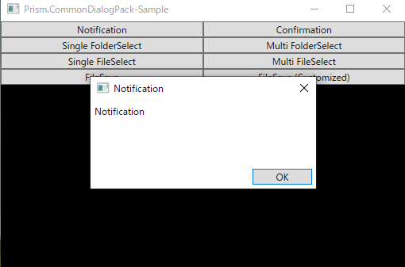
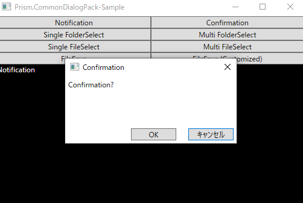
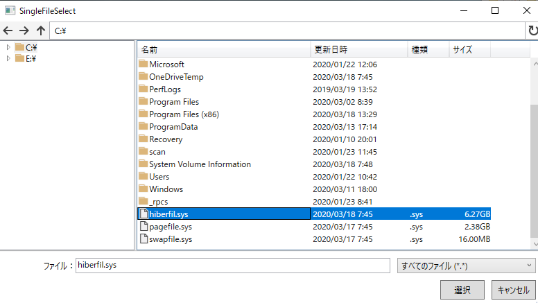
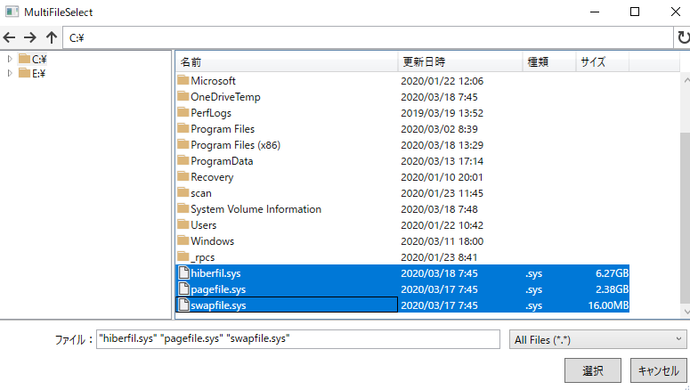
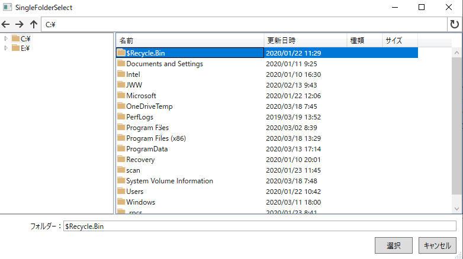
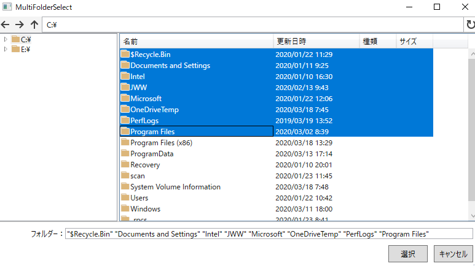
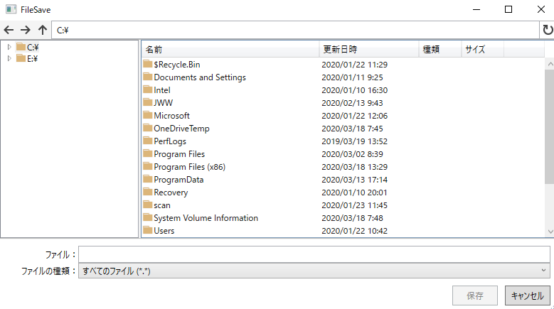
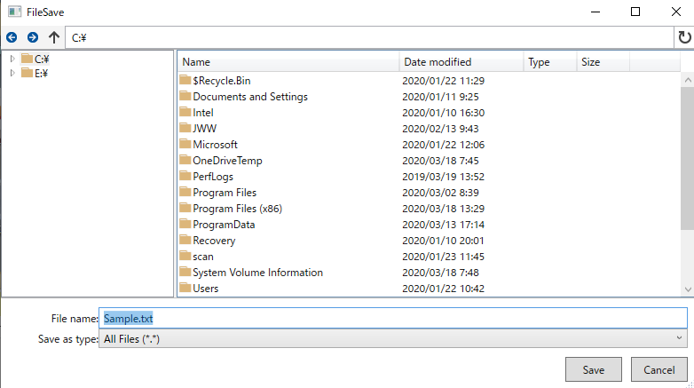
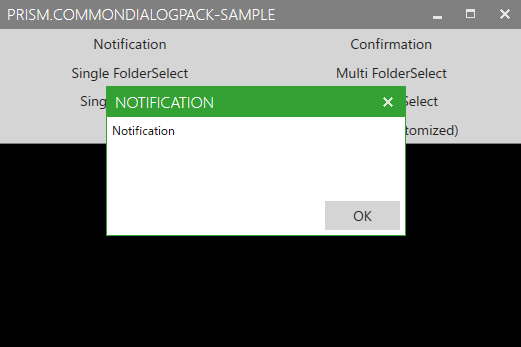

# Prism.CommonDialogPack
PrismのDialogServiceを利用した汎用的なダイアログを提供するライブラリ

# [Install](https://www.nuget.org/packages/PrismCommonDialogPack/)
nuget パッケージマネージャーコンソールで ```Install-Package PrismCommonDialogPack``` と入力する

# 機能

## 通知ダイアログ



## 確認ダイアログ



## ファイル選択ダイアログ




## フォルダ選択ダイアログ




## ファイル保存ダイアログ



## アイコンなどのカスタマイズ



## Window のカスタマイズ



# 使い方

詳しくは[ココ](https://qiita.com/kuro4/items/fdfbc130b3b10ea64b38)
