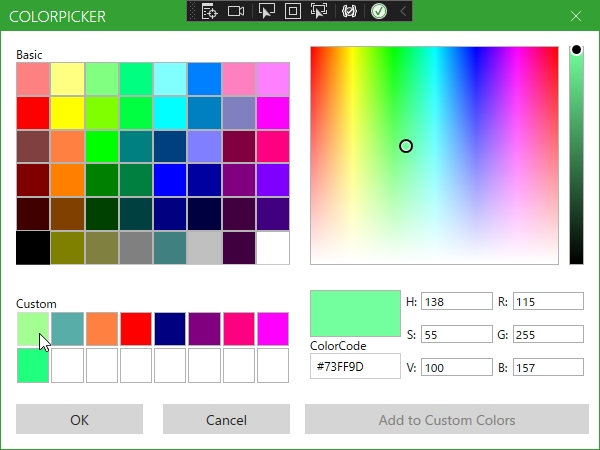

# Prism.CommonDialogPack
Prism の IDialogService を利用した、汎用的なダイアログを提供するライブラリです。 
また、Dialog の呼び出し側から Window と Content の Width, Height や WindowStartupLocation, ResizeMode, SizeToContent などの指定をすることが可能になっています。 
さらに、呼び出し側では Window の Style も指定することができ、指定した Style が Dialog の Window に Binding される `StyleableDialogService` を提供しています。 
`StyleableDialogService` を使用することで、[MahApps.Metro](https://github.com/MahApps/MahApps.Metro)などの通常とは異なる Window を使用する際でも正しく Style が反映されます。

## [Install](https://www.nuget.org/packages/PrismCommonDialogPack/)
nuget パッケージマネージャーコンソールで `Install-Package PrismCommonDialogPack` と入力します。

## Documentation
* [Quick Start](https://github.com/Kuro4/Prism.CommonDialogPack/wiki/Quick-Start)
* [wiki](https://github.com/Kuro4/Prism.CommonDialogPack/wiki)

# 機能

## Notification Dialog

## Confirmation Dialog

## FileSelect Dialog
Single select.

Multi select.

## FolderSelect Dialog
Single select.

Multi select.

## FileSave Dialog

## アイコンなどのカスタマイズ

## Progress Dialog

## ColorPicker Dialog

## DialogWindow のカスタマイズ

